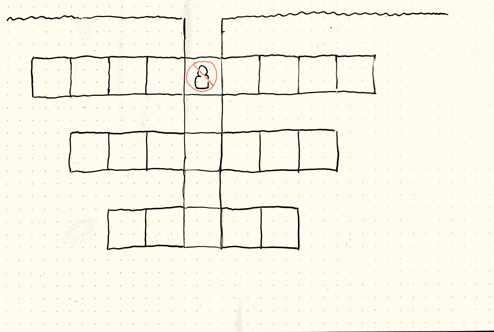
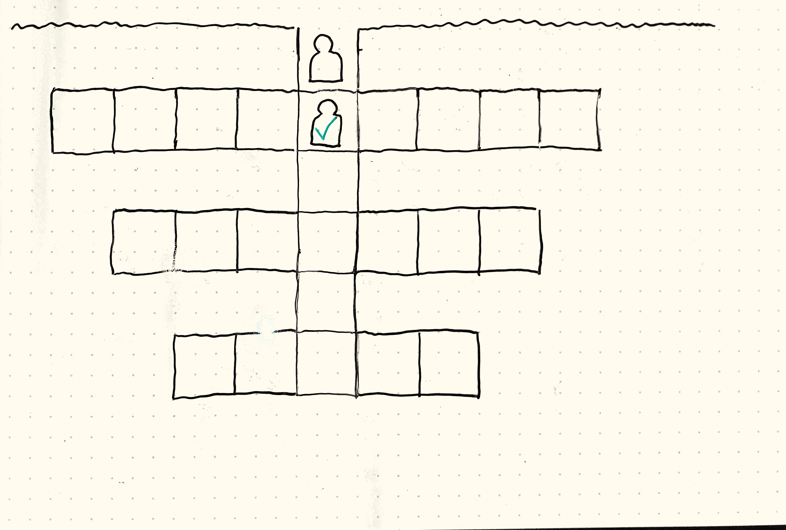
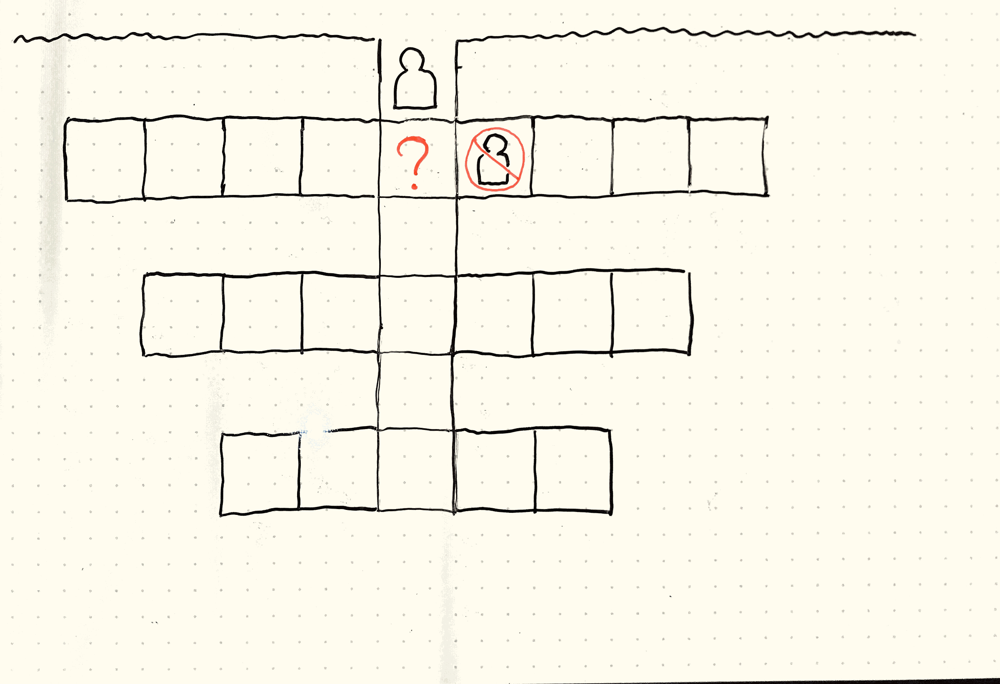
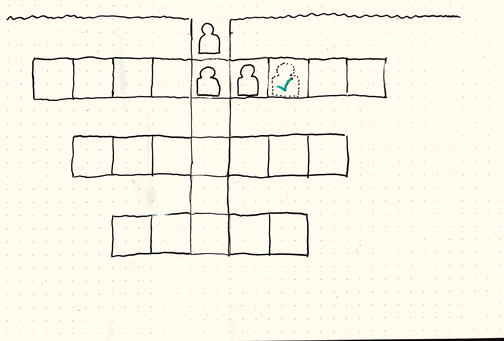
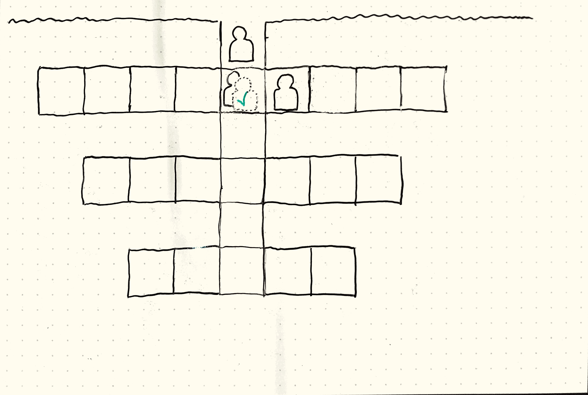

# Magnum Sal: Event Sourced

[Magnum Sal](https://boardgamegeek.com/boardgame/73316/magnum-sal) is a fun board game about mining salt out of the famous Polish salt mine [Wieliczka](https://www.wieliczka-saltmine.com/)

## The goal of this repo
Play around with EventSourcing and try not to make any assumptions on what domain classes you need and only create one when multiple events have hinted at one.

## Quick-start (+- 60' Kata time)
### The actual kata exercise
Make sure no impossible states can occur according to the Magnum Sal rules, but only stick to implementing the Chain Rule.

Postpone creating domain classes as long as possible, purely rely on the `EventStream` instead.

Keep your events as fine-grained as possible, and **always** in past tense.

Forget about two players and the town and the corridors. Just focus on the mine shaft and the chain rule 

1) Player 1 places a miner in the mineshaft's first spot.
1) Player 1 removes a miner in the mineshaft's first spot.
1) Player 1 places a miner in the mineshaft's first spot again.
1) Player 1 places a miner in the mineshaft's second spot.
1) Player 1 removes their miner in the first spot. <-- this should be an illegal move, because the first spot should be occupied according to the chain rule.

`MineShaftPosition` already contains some validation and util functions that'll prove useful, check out the tests to see how it works.

### Some functional knowledge required
First, for the exercise to make sense you'll need to know some basic rules of the board game Magnum Sal that are relevant to the kata at hand.

Magnum Sal is a board game where you try to please the King by fulfilling specific orders of salt. As a player, you can mine salt out of the salt mine in different qualities and deliver the salt to the palace.

Usually you'll be working together to mine some salt of the mine, and players whose miners were used for transporting salt out of the mine will be paid for their work.

When placing or removing workers in or from the mine, a player should always take into account that whatever you do, there must always be a chain of miners that lead to the top of the mine. Otherwise, no salt can be mined from a chamber and brought back up out of the mine.

Here are some examples:

1) You can't place a miner in the mine when there's no miner at the top of the mineshaft

1) You **can** place a miner if there **is** a miner at the top of the mineshaft

1) You can't place a miner when a gap would occur

1) You can't remove a miner when a gap would occur

1) You **can** remove a miner when no gap would occur

1) You also **can** remove a miner when there would still be another miner left after removal 



### Hint: Asserting exceptions
If you want to write a test that asserts an exception is thrown when illegal code gets executed:

Here's how I asserted that there can't be a MineShaftPosition at 0:
```kotlin
assertThatExceptionOfType(IllegalArgumentException::class.java)
                .isThrownBy { MineShaftPosition(0) }
                .withMessage("MineShaftPosition 0 does not exist.")
```


## Magnum Sal rules
It does!

But all shits 'n giggles aside, here are [the condensed rules](./condensed-rules.md), if anything's unclear here is [the actual rulebook](./rulebook.pdf).
